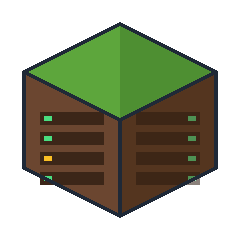
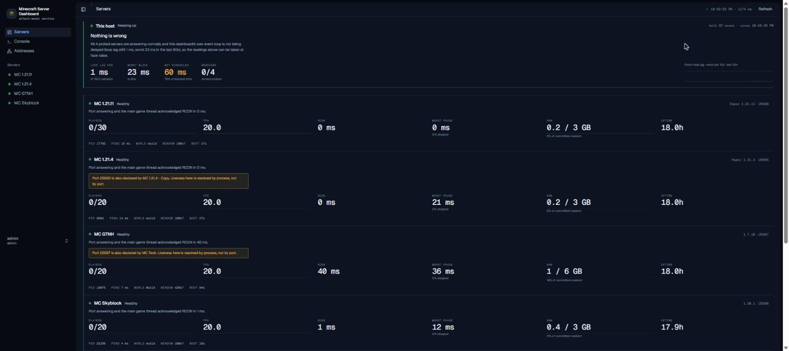
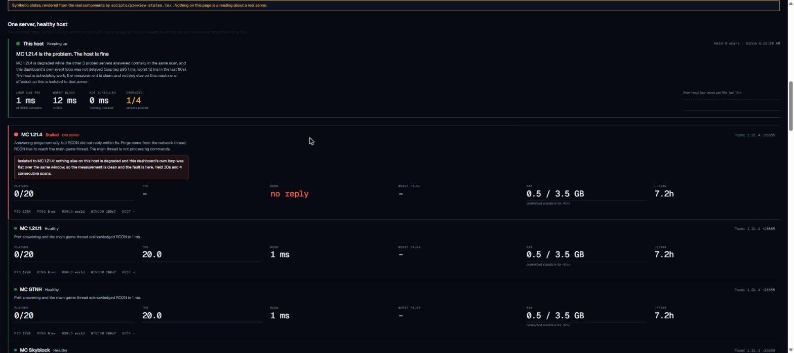
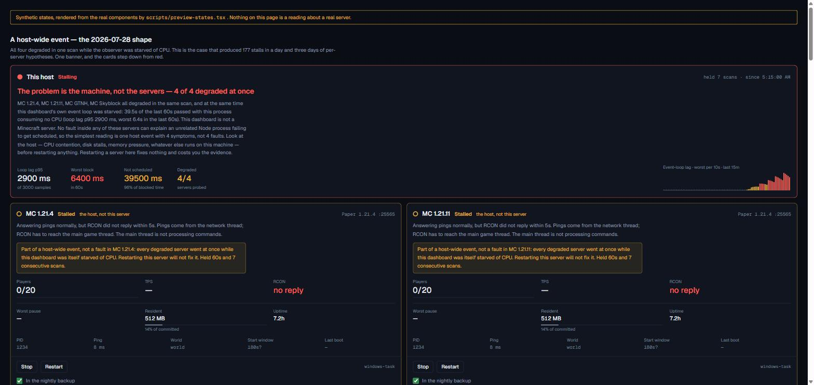
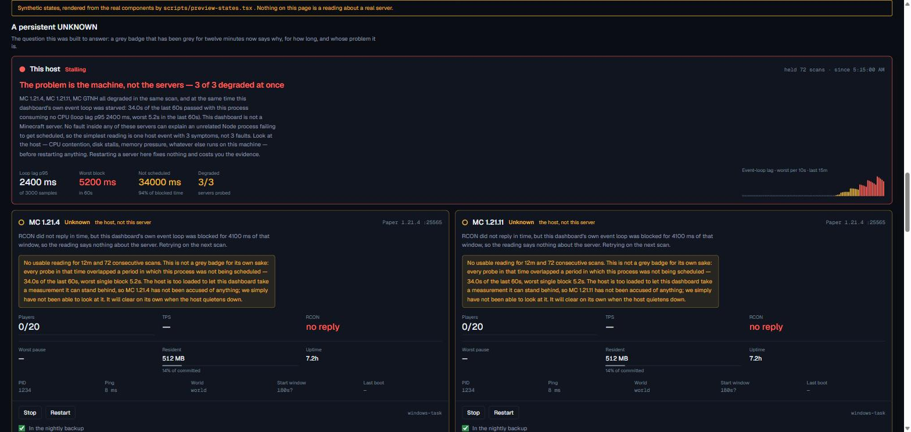
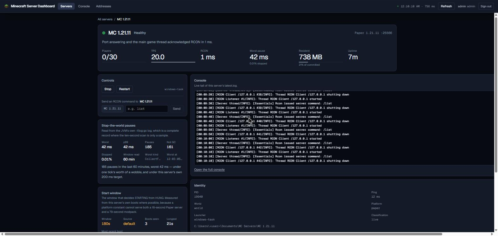
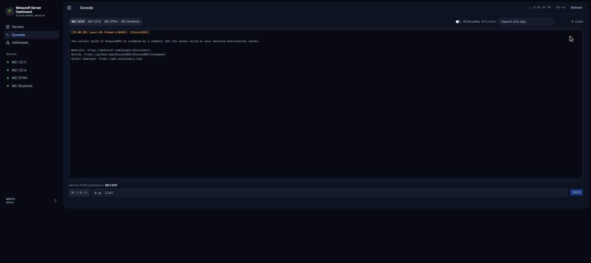

<div align="center">



# Minecraft Server Dashboard

**A self-hosted dashboard for Minecraft servers it did not start.**

[](LICENSE)
[](docs/install.md)
[](https://www.typescriptlang.org)
[](docs/platform-support.md)

</div>

---

Every in-game panel reports health from a scheduled task on the server's **main
thread**. When that thread wedges, the task stops too, and the panel keeps
showing the last numbers it collected: a server frozen for two minutes still
reads 20.0 TPS and a green light. The component that would notice is the
component that stopped.

This dashboard watches from **outside the process**, so it cannot be frozen by
the thing it is measuring. It compares two independent probes:

| Probe | Answered by | Proves |
| --- | --- | --- |
| Server List Ping | the network thread, from a cached status | the port is open. Nothing more |
| RCON round trip | the main game thread, which must execute it | the game loop is actually running |

A server answering pings in 8 ms while RCON times out is neither healthy nor
down. It is **`STALLED`**, a state no in-process panel can report about itself.
And because it reads the whole fleet at once, it can say the other thing no
per-server tool can: **four servers degrading at the same moment is one machine
problem, not four server faults**, in one sentence at the top of the page.

It also **manages your server where it already is.**

Every comparable panel wants to own the files. Pterodactyl creates its own
container volume and has no way to register a directory you already have. AMP
tells you to zip your server and upload it into an instance AMP created.
Crafty imports a zip and **copies** it into its own managed folder, which has
put at least one user out of disk space importing a large server. All of them
also spawn the server as a child and own its stdin, so none can say anything
about a server it did not start.

This one never copies and never wraps. It tails `logs/latest.log`, sends RCON,
and works out which JVM owns which directory from the process tree, so it can
attach to a server that was already running before the dashboard existed,
including one started at boot by Task Scheduler or by hand from a terminal.
Your folders stay exactly where you put them. See
[docs/comparison.md](docs/comparison.md) for what each of those panels
actually does, with sources.

## Screenshots

<table>
<tr>
<td width="50%">


**A healthy fleet is deliberately colourless.** Green survives only as a small
dot, so any colour on this page means something wants attention. Boot times are
measured per server: 16 s for Paper, 79 s for the 1.7.10 modpack.
</td>
<td width="50%">


**A stalled server.** Answering pings, not answering RCON. The card names which
thread is silent and tags the fault **this server**, because the host panel
says the machine is fine. *Rendered state, see note.*
</td>
</tr>
<tr>
<td width="50%">


**A host-wide event.** All four degraded at once while the observer itself was
starved: one sentence about the machine, and the cards step *down* from red,
tagged **the host, not this server**. *Rendered state, see note.*
</td>
<td width="50%">


**`UNKNOWN`, explained.** Dashed dot, dashed rail: a claim about the
measurement, not the server. The card says how long it has held and that the
server has not been accused of anything. *Rendered state, see note.*
</td>
</tr>
<tr>
<td width="50%">


**One server, in full.** Controls, the JVM's own stop-the-world pauses, the
measured start window, identity, a live tail. The RCON box lives here and
names its target twice, so `stop` cannot be aimed at the wrong server.
</td>
<td width="50%">


**Live console.** One tab per server, tailed from disk, rotation-aware,
searchable, and filtered of the dashboard's own RCON polling by default, so an
idle server's console is not the tool talking to itself.
</td>
</tr>
</table>

> The healthy fleet, console and detail shots are real, captured over the LAN
> from a second PC; the public IP is a placeholder. The three marked *rendered
> state* cannot be requested from a live fleet on demand, so they come from
> `npm run preview-states`, which renders the real components from synthetic
> snapshots and says so in a banner that is left in frame.

## Features

- **Six-state health**: `HEALTHY` / `STALLED` / `STARTING` / `HUNG` / `DOWN` /
  `UNKNOWN`. Up and working are different questions, and no usable reading is
  reported as doubt, never as an accusation.
- **Fault attribution**: the dashboard measures its own event-loop lag as a
  host metric, splits it into "our fault" and "the machine's", and reads the
  fleet together to say whose problem a bad minute actually is.
- **Pauses the scan cannot see**: stop-the-world pauses parsed from each JVM's
  `-Xlog:gc*,safepoint` log, so a server that freezes for 1.6 s between two
  healthy probes stops reading green.
- **Discovery, not configuration**: point it at a directory; servers are found
  and classified as live, retired, stale or not-a-server on every scan.
  Identity comes from the process tree, never from a port.
- **Control through the mechanism the server already has**: start uses the
  server's own scheduled task or script; stop is RCON `stop` with a world
  flush, never a kill. No identifiable launcher, no start button, with the
  reason on the card. Double-spawns are detected and alarmed, and honestly
  documented as not preventable by an attached observer.
- **Measured start windows**: how long a server may be silent before `HUNG` is
  learned from its own boots. 16 s Paper and 79 s modpack are not one constant.
- **Live console** that survives rotation and restart, with the dashboard's
  own RCON polling filtered out by default and a toggle to bring it back.
- **Connection addresses**: LAN, public IP with change detection, and Dynmap
  links that distinguish configured from actually responding.
- **Auth that ends**: scrypt, admin and viewer roles, sessions with absolute
  and idle expiry, an append-only audit log, and a wire contract with no
  credential field in it, asserted by proof.
- **Proofs, not claims**: every hard-won rule ships with a script that
  reproduces the failure it prevents, run against real servers.

## Quick start

Windows 10 or 11, 64-bit. Nothing to install first: **no Node, no npm, no
git.** The download carries its own copy of Node.js.

1. Download `minecraft-server-dashboard-<version>-win-x64.zip` from
   **[Releases](https://github.com/MhmdMK277/Minecraft-Server-Dashboard/releases)**.
2. Right-click the zip → **Properties** → tick **Unblock** → **OK**.
   *(Skipping this only means Windows warns you at step 3.)*
3. Extract it anywhere, then double-click **Start Dashboard.bat**.
4. Open **<http://127.0.0.1:8422>**. The first start prints an `admin`
   password once, in the black window. Copy it before closing anything.

Servers in `Documents\MC Servers` appear on their own. If yours live
elsewhere, the **Attach** page searches your profile, Documents, Desktop and
two levels down each drive, and offers what it finds; nothing is added
without you saying so.

To uninstall, delete the folder. To reach the dashboard from another machine
on your network, use **Start Dashboard (whole network).bat** and read what it
says first.

That is the whole of it. Everything below is detail you can come back for.

### With Scoop

```
scoop bucket add mcdash https://github.com/MhmdMK277/Minecraft-Server-Dashboard
scoop install minecraft-server-dashboard
```

Checksum verified for you, start-menu shortcut, `scoop update` for new
versions. This repository is its own bucket.

### From source

```bash
git clone https://github.com/MhmdMK277/Minecraft-Server-Dashboard.git
cd Minecraft-Server-Dashboard
npm install
npm run build
npm start
```

Needs Node 22+. `npx tsx scripts/package-release.ts` builds the same zip the
releases are cut from, into `release/`.

### Settings

All optional. The dashboard runs with none of them set.

| Variable | Default | Purpose |
| --- | --- | --- |
| `MCDASH_SERVERS_ROOT` | `Documents\MC Servers` | Directory containing your servers |
| `MCDASH_HOST` | `127.0.0.1` | Bind address; anything wider warns at startup |
| `MCDASH_PORT` | `8422` | HTTP and WebSocket, one port |
| `MCDASH_DATA_DIR` | OS app-data directory | Config, sessions, audit log |
| `MCDASH_TRUST_PROXY` | off | Set to `1` behind a reverse proxy or tunnel |

For full health a server needs `enable-rcon=true` in its `server.properties`,
because only an RCON round trip can probe the main game thread. Without it
health honestly reads `UNKNOWN` rather than being guessed from the port.

More on installing, on what Windows says about an unsigned download, and on
how to verify the artifact yourself: [docs/install.md](docs/install.md).

### How discovery works

There is no server list to maintain. Every scan, the dashboard reads the
servers root and treats each direct subdirectory containing a `level.dat` as
a server. Running servers are recognised by matching Java processes to those
directories through the process tree and their launch mechanisms (a Windows
scheduled task whose action names the directory, or a `start.bat` inside
it), never by port, because two directories can declare the same port and
one of them is usually a copy.

For a fresh machine, that means a server appears when:

1. its directory sits directly under the servers root and holds a world
   with a `level.dat` (a stopped server still appears, shown as not
   running);
2. `enable-rcon=true` is set for health beyond up-or-down, since only an
   RCON round trip can probe the main game thread; without it the server
   honestly reads `UNKNOWN`;
3. it has a findable way to start, a scheduled task or a `start.bat`, or
   the dashboard offers no start button rather than guessing a command
   line.

**Discovery is per machine.** The service reads the process table of the host
it runs on, so it can only see servers on that machine. The browser can be
anywhere on your network, but a server running on a different computer needs
its own instance of the dashboard there. Attaching a folder does not change
this: an attached folder is still a local folder.

Directories without a `level.dat` are listed as ignored, with the reason
each was skipped. Marking a server `retired` is an operator judgement and
lives in `config.json` in the data directory, never inferred.

> **Do not port-forward this panel.** It is plain HTTP holding RCON
> credentials server-side. For remote access use a tunnel (Tailscale,
> Cloudflare Tunnel) and `MCDASH_TRUST_PROXY=1`.

## Verifying it

Every rule that cost real debugging has a script that reproduces the failure
it prevents, from `prove-stall` (suspend a live server's main thread, assert
`STALLED` is reported while pings keep answering) to `prove-concurrent-start`
(the double-spawn guard, written before the guard was trusted). Run
`npm run crossvalidate` first; the full list and the evidence behind each rule
are in [docs/liveness-spec.md](docs/liveness-spec.md) and
[docs/proof-coverage.md](docs/proof-coverage.md).

## Troubleshooting

| Symptom | What it means |
| --- | --- |
| `EADDRINUSE` on start | An earlier instance still holds the port, and it will answer probes while the new one refuses to start. Kill the old `node` by command line, by PID. |
| "That servers directory does not exist" | `MCDASH_SERVERS_ROOT` is unset and the default is not where your servers are. Reported instead of shown as an empty list, because no servers and wrong path look identical otherwise. |
| A server shows `UNKNOWN` forever | The card says which cause: RCON not configured (permanent until you edit `server.properties`), or the host too loaded to measure through (named, with how long it has held). |
| A running server shows `DOWN` | Identity failed. Run `npm run probe` and read the attribution counts; zero across the board means processes could not be enumerated at all, which is not the same as nothing running. |
| Cannot reach it from another machine | It binds `127.0.0.1` unless told otherwise, and `localhost` is whichever computer is asking. Bind `0.0.0.0` and use the host's LAN address. |

## Stack

Node 22 + TypeScript strict, Fastify 5 with one listener for REST, WebSocket
and the built UI, React 19 + Vite + Tailwind 4 with shadcn/ui, zod as the one
contract shared by server and browser. No database: state is a scan, and the
servers are the source of truth. Sessions and passwords are scrypt-hashed and
stored in the per-user data directory; credentials from server directories
never cross the wire, asserted by `npm run prove-websocket`.

## Security

[docs/security-audit.md](docs/security-audit.md) records the M4 audit: the
threat model, every check with its command and result, what is deliberately
out of scope and why, and what a stranger should run to reproduce all of it.
It found and fixed one critical vulnerability (an authentication bypass via
URL percent-encoding) and four lower-severity issues, and it is explicit
about which parts of the audit are independent of the author and which are
not. CodeQL runs on every push and weekly; results are in this repository's
Security tab.

## Provenance

This repository was published as a single commit. The development history
exists but was squashed at publish because early commits contained private
infrastructure details (a real public IP, usernames, LAN topology) that do
not belong in a public repo. The code was built with heavy AI assistance
under human review; the security-sensitive paths (authentication, RCON
credential handling, and everything that writes into a server directory)
are personally audited, and each ships with proof scripts that run against
real servers.

## Contributing

Read [docs/liveness-spec.md](docs/liveness-spec.md) before touching discovery,
parsing or health: nearly every odd-looking guard exists because something
real broke, and the comments name the observation. Behaviour changes that can
destroy data or misreport state need a proof script. Nothing may hardcode a
machine, path, router or server name. Never log, render or commit a
credential.

## License

[MIT](LICENSE)
