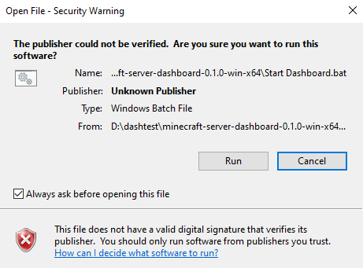

# Installing

Two ways in. Both give you the same thing: a folder that runs in place. There
is no installer, no service registration, no start-menu clutter beyond an
optional shortcut, and nothing written outside the folder except your own
settings.

## Download and run

1. Download `minecraft-server-dashboard-<version>-win-x64.zip` from
   [Releases](https://github.com/MhmdMK277/Minecraft-Server-Dashboard/releases).
2. Right-click the zip, **Properties**, tick **Unblock**, **OK**. See
   [What Windows says](#what-windows-says) for why.
3. Extract it anywhere.
4. Double-click **Start Dashboard.bat**.
5. Open <http://127.0.0.1:8422>.

The first start prints an administrator username and password in the black
window. It is shown once and stored only as a hash, so copy it before you
close anything.

To reach the dashboard from another machine on your network, use
**Start Dashboard (whole network).bat** instead, and read what it says first.

To uninstall, delete the folder. Your sign-in and settings live in
`%APPDATA%\minecraft-server-dashboard`; delete that too for a clean sweep.

## Scoop

```
scoop bucket add mcdash https://github.com/MhmdMK277/Minecraft-Server-Dashboard
scoop install minecraft-server-dashboard
```

Scoop verifies the SHA256 for you, puts a **Minecraft Server Dashboard**
shortcut in the start menu, and `scoop update minecraft-server-dashboard`
takes new versions. `scoop uninstall` removes the app and leaves
`%APPDATA%\minecraft-server-dashboard` alone, so your settings survive an
uninstall-reinstall.

This repository is its own bucket; the manifest is in `bucket/`.

## What you need

Windows 10 or 11, 64-bit. Nothing else. **Not** Node.js, npm, git, a build
toolchain, or the repository. The zip carries its own copy of Node.js, and
the launcher calls it by relative path, so an installed Node, a wrong version
of one, or none at all makes no difference.

There is no macOS or Linux artifact. The service runs there (it is Node), but
process identity, which is how the dashboard tells a running server from a
port that answers, is implemented for Windows only. It refuses to start on a
platform it cannot identify processes on rather than reporting an empty fleet
that looks like "you have no servers".

## What Windows says

Anything downloaded with a browser is tagged with the *mark of the web*, and
Windows Explorer copies that tag onto every file it extracts from the zip.
Verified on the real artifact:

| File | Mark of the web after extracting | After ticking Unblock first |
| --- | --- | --- |
| `Start Dashboard.bat` | present | gone |
| `node\node.exe` | present | gone |
| `app\server.mjs` | present | gone |

So if you did not unblock the zip, Windows will put a warning in front of the
launcher the first time you run it, because the launcher is a `.bat` and a
`.bat` has no publisher to check. Ticking **Unblock** on the zip before
extracting removes the tag from everything inside it, which is why step 2 is
step 2.

The bundled runtime is *not* an unknown binary: it is the official
nodejs.org build, copied unmodified, and its Authenticode signature survives
the trip through the zip.

```
signer     CN=OpenJS Foundation, OU=Nodejs, O=OpenJS Foundation, ...
status     Valid
```

The release workflow checks that signature before bundling and fails the
build if it is not valid, because an unsigned runtime would turn every
download into a hard SmartScreen block.

Nothing here is code-signed by this project. A code-signing certificate is a
recurring cost for a hobby project, and buying one was deliberately skipped
rather than forgotten. The honest consequence is the warning above: you are
trusting the download, the checksum, and the source, not a certificate with
this project's name on it.

This is the dialog as Windows actually shows it, captured on first run of
`Start Dashboard.bat` from a release zip downloaded through a browser and
not unblocked:



## Verifying the download

Every release publishes `SHA256SUMS` next to the zip.

```powershell
Get-FileHash .\minecraft-server-dashboard-0.1.0-win-x64.zip -Algorithm SHA256
```

Compare it against the line in `SHA256SUMS`. Scoop does this for you.

## Verifying this yourself

The claim that the zip runs on a machine with no toolchain is tested, not
assumed. `scripts/accept-release.ts` extracts the published zip somewhere
else entirely, cuts `PATH` down to the two Windows system directories,
asserts that `node`, `npm`, `npx` and `git` are all unreachable in that
environment, and only then runs `Start Dashboard.bat` and checks that the
real dashboard answers, including that a guarded route still refuses an
unauthenticated request. It runs in CI on every tag, before the release is
created.

```
npx tsx scripts/package-release.ts
npx tsx scripts/accept-release.ts
```

**What that test cannot tell you.** A stripped `PATH` is not a clean machine.
It proves the artifact does not reach for a toolchain, which is the failure
mode that actually happens; it does not prove anything about a Windows
install that is missing something this developer machine happens to have. To
close that gap properly:

1. Take a Windows 10 or 11 x64 machine, or a virtual machine, that has never
   had Node.js, npm or git installed. Windows Sandbox is the cheap version of
   this if you have Windows Pro or Enterprise; it is not available on Home.
2. Download the release zip in a browser, so it carries the mark of the web
   the way a stranger's download does.
3. Do **not** unblock it. Extract, double-click `Start Dashboard.bat`, and
   photograph whatever Windows says. That is the screenshot this page is
   missing.
4. Confirm the dashboard answers at <http://127.0.0.1:8422>.

Anything that fails there is a real bug in the artifact and worth an issue.

## Where things live

| | |
| --- | --- |
| the app | wherever you unzipped it. Delete to uninstall. |
| settings, sign-in, audit log | `%APPDATA%\minecraft-server-dashboard` |
| your Minecraft servers | untouched. Nothing is written into a server folder unless you change a setting from inside the dashboard. |

## Building it yourself

```
git clone https://github.com/MhmdMK277/Minecraft-Server-Dashboard
cd Minecraft-Server-Dashboard
npm install
npx tsx scripts/package-release.ts
```

The zip lands in `release/`. Add `--node <path\to\node.exe>` to bundle a
specific runtime rather than the one running the script.
